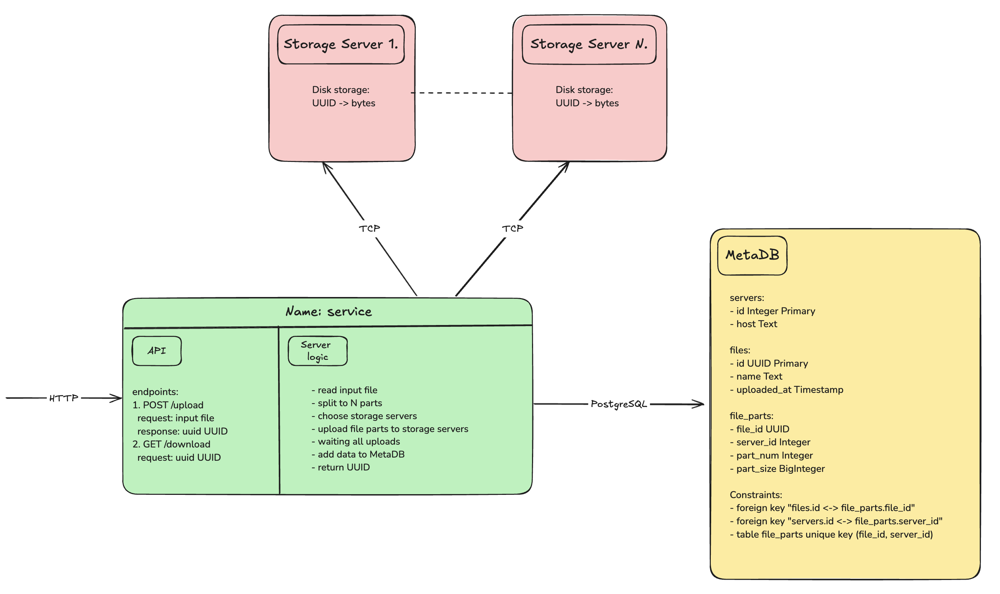

# Что это?
MVP-версия сервиса загрузки и распределенного хранения файлов.

# Как работает
1. HTTP сервер `service`.
2. TCP сервера `storageN`, где N >= 1, с хранением данных на диске.
3. БД `MetaDB` с мета информацией о файлах, частях файлов и серверах хранения.

Загрузка файла:
1. Файл загружается через `multipart/form-data` на `service` через эндпоинт `/upload`.
2. При загрузке файла первые 100МБ хранятся в памяти, остальные хранятся на диске.
   
    Максимальный размер файла, допустимого к загрузке на сервер, 10ГБ.

    Оба числа настраиваются через конфиг файл.
1. Генерируем уникальный идентификатор `UUID` для файла, по которому клиент в будущем будет скачивать этот файл.
2. На основе информации в `MetaDB` о занятом месте на серверах `storage` равномерно выбираются сервера для хранения частей файла.

    На данный момент считаем, что все `storage` сервера одинакового первоначального размера.
1. Делим файл на соответствующие куски.

    Все манипуляции с байтами происходят через интерфейс `io.Reader`, чтобы количество дополнительной потребляемой памяти оставалось O(1).
1. Параллельно и асинхронно загружаем все части файла на соответствующие сервера `storage` по протоколу TCP.

    В данной реализации `storage` сервера хранят полученные байты на диске.
1. После успешной загрузки данных на все сервера `storage` добавляем информацию о файле, его частях и о серверах в `MetaDB` одной транзакцией.

Скачивание файла:
1. Полученный `UUID` можно передать в `service` через эндпоинт `/download`.
2. По указанному идентификатору из `MetaDB` получаем сервера `storage`, где хранятся части файла, и их порядок.
3. Параллельно и асинхронно скачиваем эти части файла и объединяем в нужном порядке.

    Чтобы не происходило дополнительного копирования частей файла в память, работаем с интерфейсом `io.Reader`, представляющим собой `net.Conn` к `storage`-серверам.
1. Записываем файл в ответ HTTP-сервера.



# Как запускать
```
# Запустить докер-контейнеры
make run

# После этого запустить интеграционный тест (см. `tests/integration-test.sh`)
make integration-test
```

# Интеграционные тесты
Bash-скрипт для тестирования и демо функциональности `tests/integration-test.sh`:
1. Генерируем тестовые файлы с различными размерами от 10 МБ до 600 МБ.
2. Загружаем последовательно файлы на сервер. Сохраняем полученные UUID.
3. Скачиваем последовательно файлы с сервера по сохраненным UUID.
4. Проверяем хеш-суммы оригинальных и скачанных файлов.
5. Очищаем все ресурсы (удаляем файлы).

Скрипт не претендует на production-ready решение для полноценного тестирования и скорее носит демонстрационный характер.

# Улучшения
1. **Сжатие файла или частей файла.**
    
    Меньше занимаемого места на диске (зависит от размера файла и его содержимого).

    Но будет использовано больше CPU и памяти во время обработки файла, и в случае использования отдельных серверов для сжатия будет лишняя передача данных по сети.
2. **Мусор на диске.**

   В случае ошибки передачи части файла на один из серверов `storage` или ошибки при добавлении файла в `MetaDB` - на некоторых серверах `storage` могут возникать неактуальные файлы, занимающие место.

    Их нужно периодически удалять.
3. **Аутентификация и авторизация.**
   
   В данной реализации файл для скачивания доступен всем, у кого есть `UUID`.
4. **Пул соединений.**

   Соединение к серверам `storage` устанавливается на каждый вызов метода `Upload`/`Download`.
    
    Нужно использовать пул-соединений для лучшей производительности.
5. **Контекст для операций.**
   
   В некоторых компонентах используется `ctx context.Context`.
  
    Нужно использовать его во всех компонентах, операция которых может быть отменена или завершена по таймауту, особенно в `loader`, который загружает данные на сервера `storage`.
6. **TLS-соединение.**

    Все соединения должны быть защищены, нужно использовать TLS-протокол.
7. **Консистентность файла.**

   Стоит рассмотреть вариант хранения хеша файла в `MetaDB` при загрузке файла и сравнение его с хешом файла при скачивании на случай некорректного результата.
8. **Атоматизация добавления новых серверов `storage`.**
   
   Добавление серверов `storage` происходит в ручном режиме в `MetaDB` и `docker-compose`.

   Есть вероятность ручной ошибки и неконсистентности конфигурации.
9.  **Ограничения на большие файлы.**

    Хотелось бы иметь механизм, чтобы определить, что скачиваемый файл занимает больше места, чем разрешенный максимальный лимит, не скачивая при этом весь файл.
10. **Избыточность серверов `storage`.**

    В случае выхода из строя сервера/диска `storage`, часть файла может быть утеряна.

    Нужно уметь переживать выход из строя как минимум одного сервера/диска.
11. **Ограничения пропускной способности сети.**
    
    При загрузке/скачивании многих файлов можем упираться помимо всего прочего в сеть.

    Нужно иметь определенный алгоритм "выдачи сети" каждому запросу.

    То есть выбирать подходящий вариант между "загружать по чуть-чуть все запросы" или "загружать не все сразу, но бОльшими порциями".
12. **Таймауты передачи файлов.**

    Передача части файла на сервер `storage` происходит без Read/Write-таймаутов к `TCP`-серверу.
    
    Нужно оценивать время загрузки части файла сверху и отслеживать это.
13. **Система хранения логов.**
14. **Tracing**
15. **Monitoring + Alerting**
