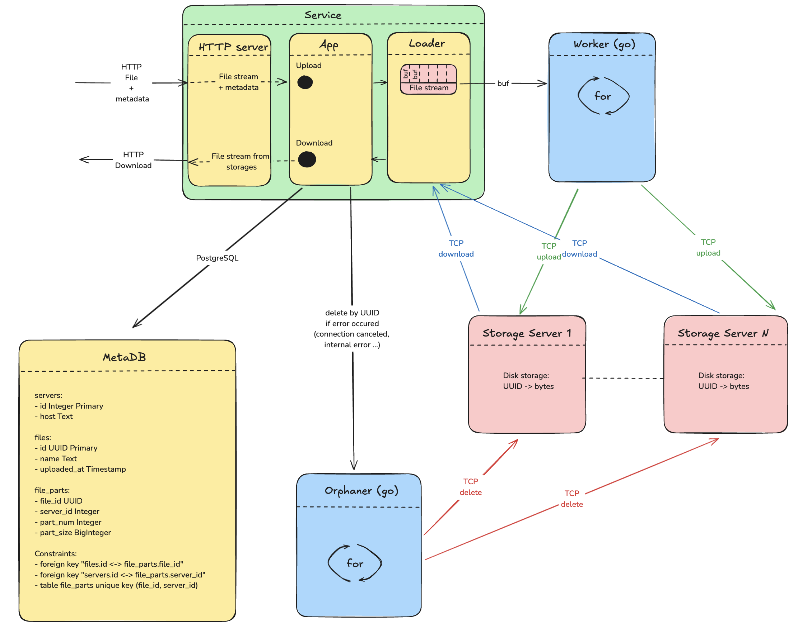

# Что это?
MVP-версия сервиса загрузки и распределенного хранения файлов.

# Как работает
1. Сервис `service` с запущенным HTTP сервером, логикой приложения в `app.go` и запущенными `storageworker` и `orphaner` в отдельных горутинах.
2. TCP сервера `storageN`, где N >= 1, с хранением данных на диске.
3. `storageworker` - загружает части загружаемых файлов на `storage`-сервера "параллельно" (в горутинах).
4. БД `metadb` с мета информацией о файлах, частях файлов и серверах хранения.
5. В случае ошибки загрузки файла отправляем сгенерированный `uuid` файла в `orphaner`, который удаляет с `storage`-серверов части файла.

**Загрузка файла:**
1. Файл загружается через `multipart/form-data` (потоково) на `service` через эндпоинт `/upload` с явным указанием размера файла.
2. Максимальный размер файла, допустимого к загрузке на сервер, 10ГБ - настройка в конфиге, как и остальные числа далее.
3. Генерируем уникальный идентификатор `UUID` для файла, по которому клиент в будущем будет скачивать этот файл.
4. На основе информации в `metadb` о занятом месте на серверах `storage` равномерно выбираются сервера для хранения частей файла.

    Здесь для более быстрого к реализации решения нужно знать размер файла, поэтому в эндпоинт `/upload` передается размер файла.

    См. улучшения для варианта без этой дополнительной информации.
5. Чтение файла происходит кусками с фиксированным размером буфера (10 КБ или, для достаточно больших файлов, 10 МБ).
6. Буфер последовательно загружается на `storage`-сервер через `storageworker`, и возвращаемся к пункту 5.
7. Записываем в `metadb` информацию о файле, если загрузка завершилась успешно и не было прерывания соединения со стороны клиента. Возвращаем клиенту `UUID`.
8. В случае прерывания соединения со стороны клиента или внутренней ошибки и невозможности загрузить файл, передаем `UUID` в `orphaner`, который вызывает удаление файла с `storage`-сервером.

**Скачивание файла:**
1. Полученный `UUID` можно передать в `service` через эндпоинт `/download`.
2. По указанному идентификатору из `metadb` получаем сервера `storage`, где хранятся части файла, и их порядок.
3. Параллельно и асинхронно скачиваем эти части файла и объединяем в нужном порядке.

    Чтобы не происходило дополнительного копирования частей файла в память, работаем с интерфейсом `io.Reader`, представляющим собой `net.Conn` к `storage`-серверам.
4. Записываем файл в ответ HTTP-сервера.



# Как запускать
```
# Запустить докер-контейнеры
make run

# После этого запустить интеграционный тест (см. `tests/integration-test.sh`)
make integration-test
```

# Интеграционные тесты
Bash-скрипт для тестирования и демо функциональности `tests/integration-test.sh`:
1. Генерируем тестовые файлы с различными размерами от 10 МБ до 1200 МБ.
2. Загружаем последовательно файлы на сервер. Сохраняем полученные UUID.
3. Скачиваем последовательно файлы с сервера по сохраненным UUID.
4. Проверяем хеш-суммы оригинальных и скачанных файлов.
5. Очищаем все ресурсы (удаляем файлы).

Скрипт не претендует на production-ready решение для полноценного тестирования и скорее носит демонстрационный характер.

# Улучшения
1. **Сжатие файла или частей файла.**
    
    Меньше занимаемого места на диске (зависит от размера файла и его содержимого).

    Но будет использовано больше CPU и памяти во время обработки файла, и в случае использования отдельных серверов для сжатия будет лишняя передача данных по сети.
2. **Мусор на диске.**

    Для очистки серверов хранения от мусора используем `orphaner`. Решение рабочее, но может быть улучшено:
    - Мы удаляем данные файла по `UUID` со всех серверов, которые указаны у файла в `metadb`. Хотя, возможно, мы загрузили данные только на часть серверов - проводить чистку нужно только на них.
    - Если наш `service` ляжет (паника, ООМ, физический выход из строя серверов), то мы теряем информацию о тех файлах, которые надо подчистить. Нужно хранить информацию о таких файлах и корректно обрабатывать их при выходе из строя сервиса.
3. **Удаление мусора не получает ответ с результатом**
    На данный момент удаление файла по `UUID` с сервера `storage` происходит без подтверждения успешности операции со стороны второго.
4. **Порядок параметров в /upload**
   Хотелось бы указывать входные параметрв `metadata` и `input-file` эндпоинта `/upload` в независимом порядке.

   См. следующий пункт.
5. **Улучшенная схема распределения байтов на storage-серверах**
    Новая схема не требует знания размера загружаемого файла.

    Идея: загружать по N-байт (фиксированное или динамическое и детерминированное) по очереди на каждый из `storage`-серверов.
    Скачивать по тому же алгоритму.

    В случае с маленьким файлом он будет храниться на серверах, количество которых меньше требуемого.
6. **Аутентификация и авторизация.**

    В данной реализации файл для скачивания доступен всем, у кого есть `UUID`.
7. **Пул соединений к storage-серверам**

    После загрузки файла на `storage`-сервер, это соединение закрывается.

    Хочется переиспользовать его для последующих файлов по возможности.
8. **TLS-соединение.**

    Все соединения должны быть защищены, нужно использовать TLS-протокол.
9.  **Консистентность файла.**

    Стоит рассмотреть вариант хранения хеша файла в `MetaDB` при загрузке файла и сравнение его с хешом файла при скачивании на случай некорректного результата.

10. **Автоматизация добавления новых серверов `storage`.**
   
    Добавление серверов `storage` происходит в ручном режиме в `MetaDB` и `docker-compose`.

    Есть вероятность ручной ошибки и неконсистентности конфигурации.

11. **Избыточность серверов `storage`.**

    В случае выхода из строя сервера/диска `storage`, часть файла может быть утеряна.

    Нужно уметь переживать выход из строя как минимум одного сервера/диска.
12. **Ограничения пропускной способности сети.**
    
    При загрузке/скачивании многих файлов можем упираться помимо всего прочего в сеть.

    Нужно иметь определенный алгоритм "выдачи сети" каждому запросу.

    То есть выбирать подходящий вариант между "загружать по чуть-чуть все запросы" или "загружать не все сразу, но бОльшими порциями".
13. **Ограничение на количество горутин**
    Каждый http-запрос, каждая загрузка части файла в `worker`'е, подчистка в `orphaner`'е - все, происходят в отдельной горутине.

    В последних двух нужно иметь возможность/настройку в ограничении их числа (некую локальную очередь).
14. **Таймауты передачи файлов.**

    Передача части файла на сервер `storage` происходит без Read/Write-таймаутов к `TCP`-серверу.
    
    Нужно оценивать время загрузки части файла сверху и отслеживать это.
15. **Система хранения логов.**
16. **Tracing**
17. **Monitoring + Alerting**
